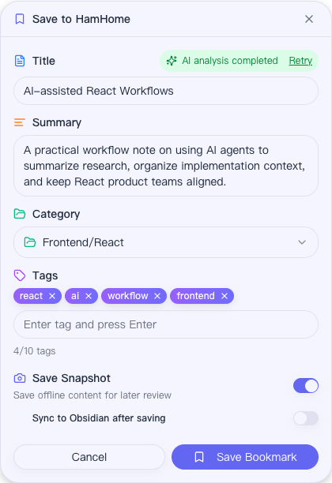
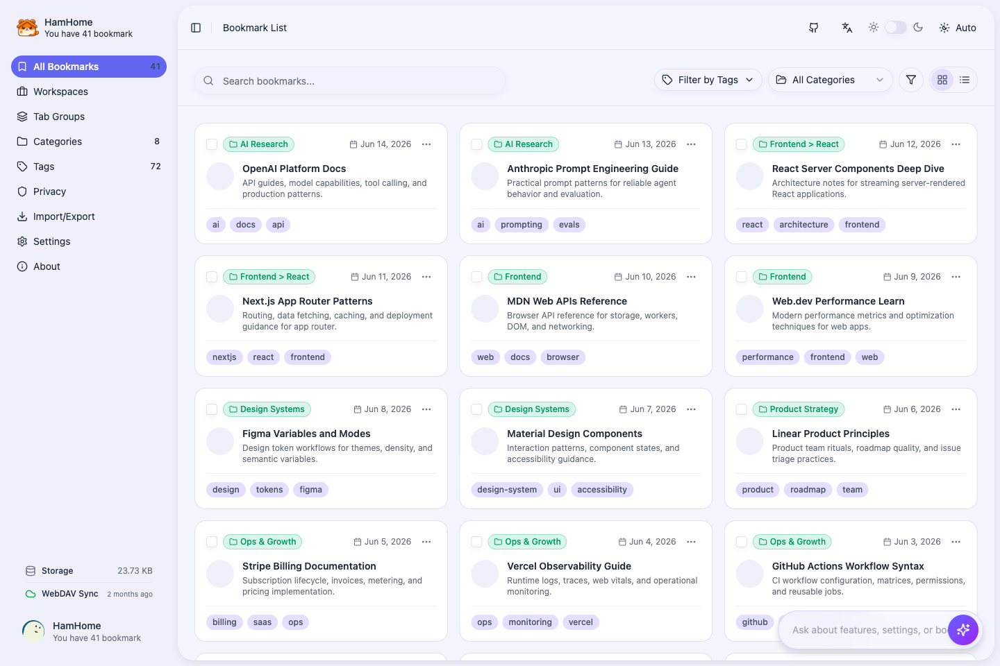
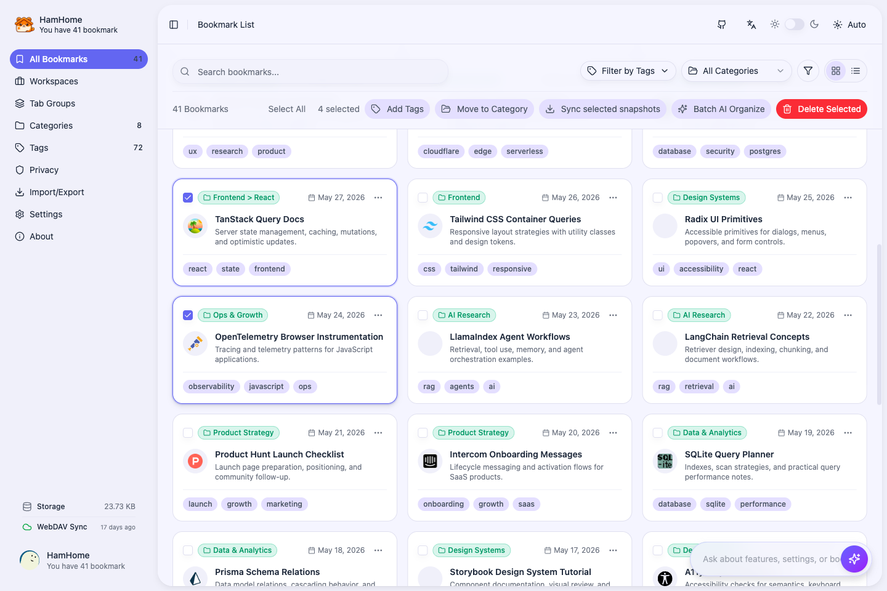
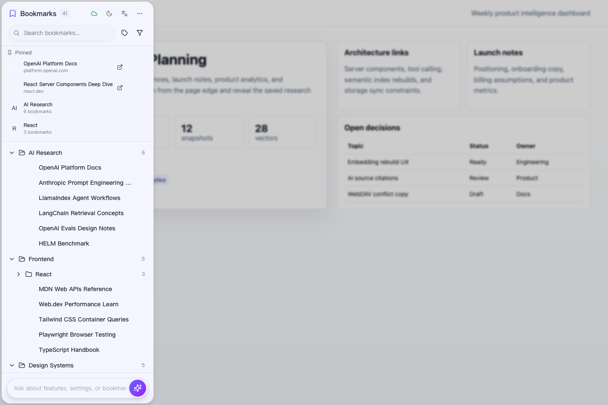
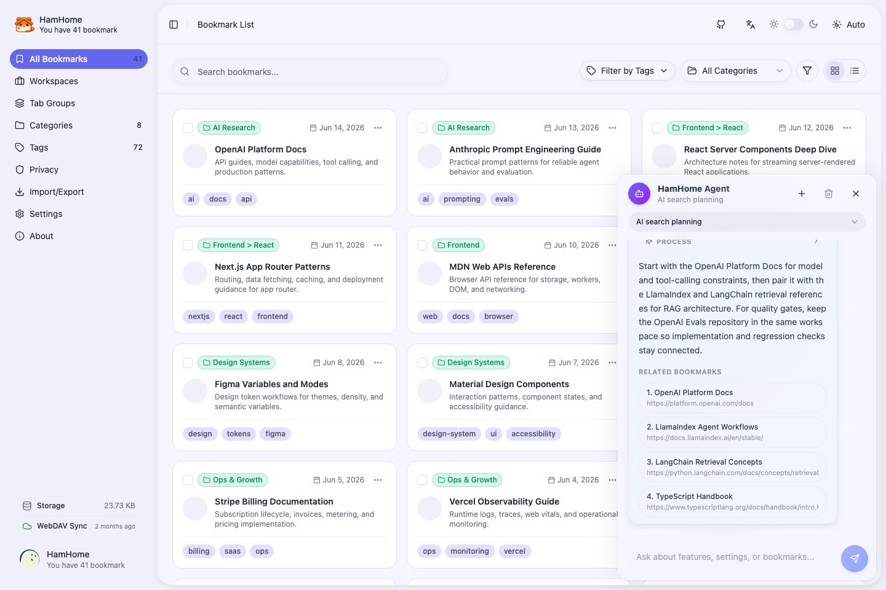
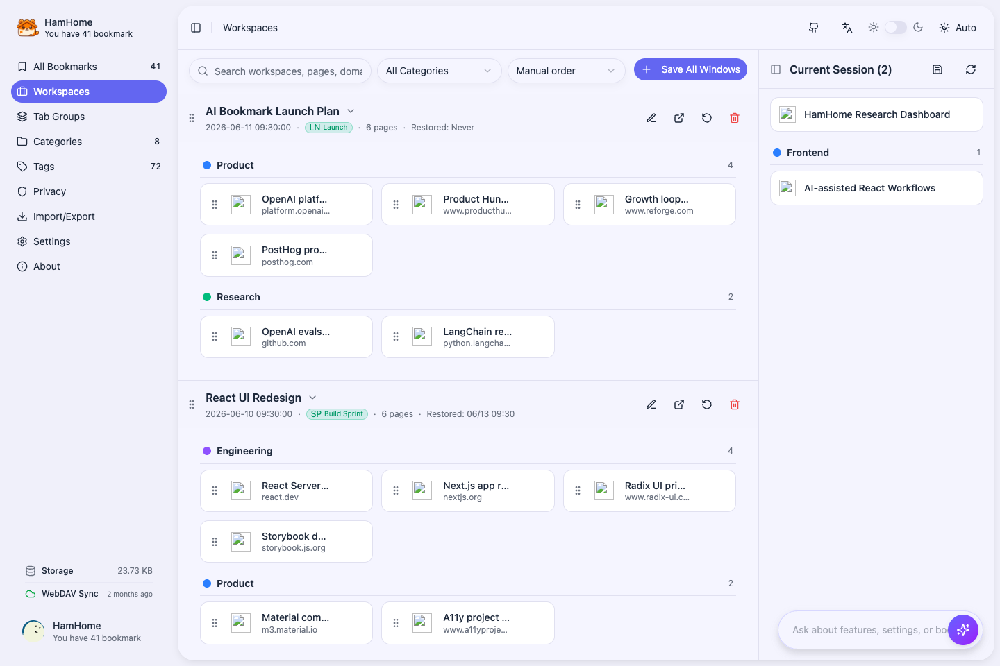
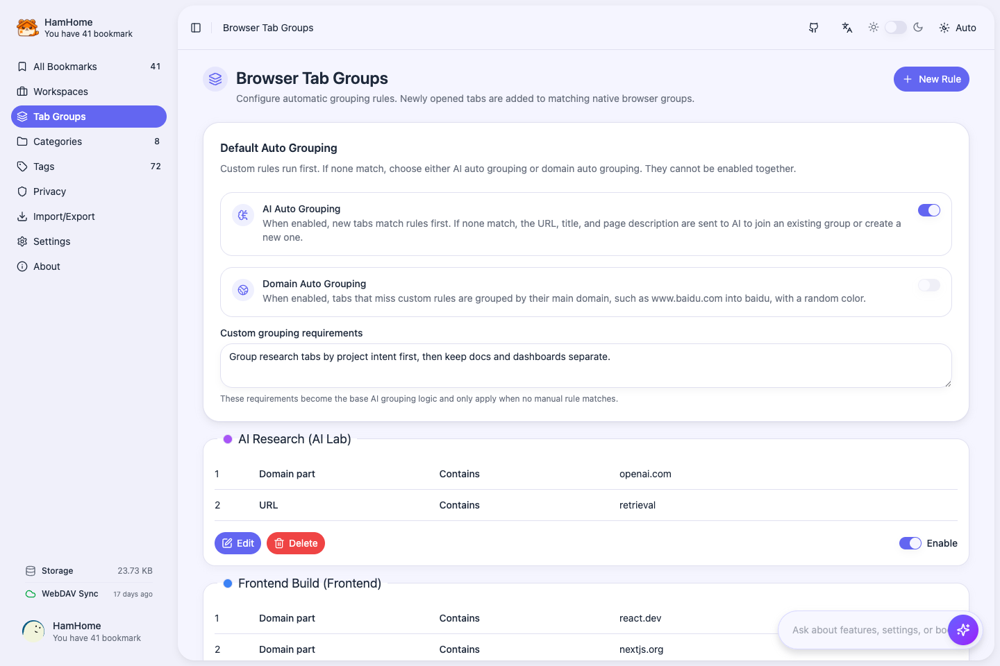
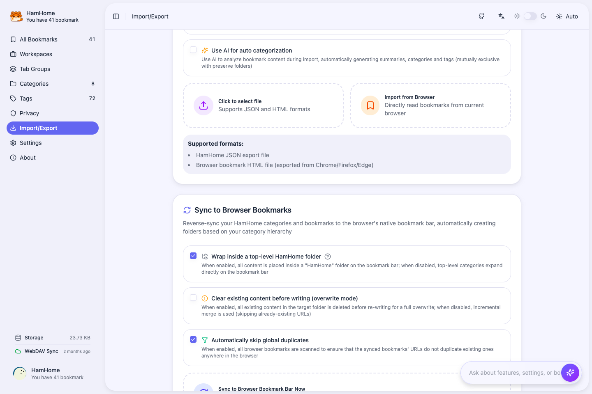

<p>
  
</p>

# HamHome

**AI browser workspace for bookmarks, tabs, sessions, and Agent-assisted extension control**

<p>
  
  
  
  
  
</p>

<p>
  <a href="https://bingoyb.github.io/ham_home/">Product Introduction</a> •
  <a href="./docs/README_zh.md">中文文档</a> •
  <a href="./docs/USAGE_en.md">Usage</a> •
  <a href="./docs/USAGE_zh.md">中文使用文档</a> •
  <a href="#features">Features</a> •
  <a href="#development">Development</a>
</p>

## What is HamHome?

HamHome is a browser extension for turning everyday browsing into an organized, searchable workspace. It combines AI-assisted bookmark saving, a full bookmark library, page snapshots, an Agent that understands and operates HamHome, restorable tab workspaces, and native browser Tab Group automation.

By default, bookmarks, categories, settings, snapshots, vectors, workspaces, and rules live in your browser storage. You can connect your own AI provider for analysis and semantic search, and optionally use WebDAV or export/import files to move structured data across devices.

👉 **[View Product Introduction](https://bingoyb.github.io/ham_home/)** - Learn more about the product and download options.

## Screenshots

| **Quick Save Popup** | **Bookmark Library** |
| :--: | :--: |
|  |  |
| **Bulk Bookmark Actions** | **In-page Content Panel** |
|  |  |
| **AI Agent** | **Workspaces** |
|  |  |
| **Tab Group Rules** | **Import, Export, and Sync** |
|  |  |

## Features

### AI-assisted bookmarking

- Save the current page from the popup, context menu, keyboard shortcut, or in-page panel.
- Extract page metadata and readable content with Defuddle, Mozilla Readability, and SingleFile-based snapshot capture.
- Generate summaries, categories, tags, and optional translations after the user configures an AI provider.
- Re-analyze existing bookmarks in bulk from the management page.

### AI Agent and search

- Search bookmarks by title, URL, description, content, category, tag, domain, and time range.
- Enable embedding-based semantic search and hybrid ranking that combines keyword and vector results.
- Use the built-in AI Agent to understand HamHome features and settings, inspect status, search/summarize saved pages, open extension views, and handle safe non-sensitive setup.
- Search from the browser address bar with the `ham` omnibox keyword when enabled.

### Workspaces and tab sessions

- Save the current window as a restorable workspace with page order, favicon, pinned state, and native Tab Group metadata.
- Restore all or selected pages into the current window or a new window, with duplicate URL skipping.
- Manage workspace-only categories and tags separately from bookmark categories.
- Analyze workspace pages for duplicates, rough purpose/category signals, and bookmark conversion candidates.
- Drag pages between workspaces or Tab Groups, edit page metadata, and convert useful pages into long-term bookmarks.

### Native Tab Group automation

- Create automatic grouping rules by domain, URL text, title, case-insensitive title, or regex.
- Configure group title, color, collapsed state, ordering, and multiple match conditions.
- Let unmatched tabs fall back to root-domain grouping or AI grouping. Manual rules always run first.
- AI auto-grouping can use page title, URL, metadata, existing group titles, and custom grouping instructions; results are cached by domain and instruction set.
- Chromium browsers apply rules through `chrome.tabGroups`; Firefox can store rules but does not run native Tab Group automation where the API is unavailable.

### Snapshots and Obsidian

- Save local HTML or Markdown snapshots for offline reading.
- View, download, update, or delete snapshots from bookmark management.
- Sync Markdown-style bookmark notes to Obsidian through the `obsidian://new` flow, with clipboard fallback and unchanged-content skipping.
- Keep snapshot storage visible and manageable from settings.

### Import, export, and sync

- Export full HamHome JSON backups containing bookmarks, categories, workspaces, workspace categories, Tab Group rules, and auto-group settings.
- Export a browsable HTML bookmark page.
- Import HamHome JSON backups or standard browser bookmark HTML files from Chrome, Firefox, and Edge.
- Import browser bookmarks directly through the browser bookmarks API, optionally preserving folder hierarchy or running AI analysis.
- Write HamHome bookmarks back to the browser bookmark bar with root-folder, clear-first, and duplicate-skip options.
- Sync structured data through WebDAV under `/HamHomeSync`: settings, bookmark/category data, bookmark text content, workspaces, workspace categories, and Tab Group configuration. Local HTML/Markdown snapshot blobs stay local unless you export or sync them through the Obsidian workflow.

### Privacy and storage controls

- Store primary data in browser storage and IndexedDB; no HamHome-hosted account is required.
- Bring your own AI key and endpoint. Supported chat providers include OpenAI, Anthropic, Google Gemini, Azure OpenAI, DeepSeek, Groq, Mistral, Moonshot/Kimi, Zhipu/GLM, Tencent Hunyuan, NVIDIA NIM, SiliconFlow, Ollama, and custom OpenAI-compatible APIs.
- Configure embeddings separately for semantic search. Supported embedding providers include OpenAI, Google, Azure, Mistral, Zhipu, Hunyuan, NVIDIA, SiliconFlow, Ollama, and custom OpenAI-compatible APIs.
- Keep sensitive domains out of AI analysis with privacy domain settings and automatic privacy detection.
- AI keys, Base URLs, privacy domains, WebDAV credentials, and browser shortcuts must be configured by the user; the Agent does not read or fill them.

### Modern extension UI

- Full extension app with bookmarks, categories, tags, workspaces, Tab Groups, import/export, privacy, settings, and about pages.
- Popup save panel for quick capture.
- In-page edge-triggered bookmark panel with left/right positioning.
- Light, dark, and system themes with English and Chinese localization.
- Sync status widget, shortcut display, custom filters, tag cloud, storage stats, and vector index controls.

## Browser Support

| Browser | Status |
| --- | --- |
| Chrome / Chromium | Manifest V3 |
| Microsoft Edge | Manifest V3 |
| Firefox | Firefox build, 109+ configured; native Tab Group automation depends on browser API support |

## Downloads

- [**Chrome Web Store**](https://chromewebstore.google.com/detail/hamhome-%E6%99%BA%E8%83%BD%E4%B9%A6%E7%AD%BE%E5%8A%A9%E6%89%8B/mkdokbchcfegdkgoiikagecikldbkbmg)
- [**Firefox Add-ons**](https://addons.mozilla.org/zh-CN/firefox/addon/hamhome-%E6%99%BA%E8%83%BD%E4%B9%A6%E7%AD%BE%E5%8A%A9%E6%89%8B/)
- [**Microsoft Edge Addons**](https://microsoftedge.microsoft.com/addons/detail/hamhome-smart-bookmark-/nmbdgbicgagmokdmohgngcbhkaicfnpi)
- [**GitHub Releases**](https://github.com/bingoYB/ham_home/releases) for manual installation packages.

## Installation from Source

```bash
git clone https://github.com/bingoYB/ham_home.git
cd ham_home
pnpm install
pnpm build:extension
```

Load the built extension:

- **Chrome / Chromium**: open `chrome://extensions/`, enable Developer mode, choose Load unpacked, and select `apps/extension/.output/chrome-mv3`.
- **Microsoft Edge**: open `edge://extensions/`, enable Developer mode, choose Load unpacked, and select `apps/extension/.output/edge-mv3`.
- **Firefox**: open `about:debugging`, choose This Firefox, choose Load Temporary Add-on, and select `apps/extension/.output/firefox-mv2/manifest.json`.

## Development

```bash
# Install workspace dependencies
pnpm install

# Run extension dev builds
pnpm dev:extension
pnpm dev:ext-firefox
pnpm dev:ext-edge

# Run the Next.js product site
pnpm dev:web

# Build
pnpm build
pnpm build:extension
pnpm build:web

# Package and submit extension builds
pnpm zip:extension
pnpm submit:init
pnpm submit:extension

# Tests and screenshots
pnpm --filter hamhome test
pnpm --filter hamhome test:e2e:install
pnpm --filter hamhome test:e2e
pnpm --filter hamhome screenshots
```

## Tech Stack

<p>
  
  
  
  
</p>

- **Monorepo**: pnpm workspaces + Turborepo
- **Extension**: WXT + React 19 + TypeScript + Tailwind CSS 4
- **Product site**: Next.js 16 + React 19
- **UI**: shadcn/ui-style primitives, Radix UI, lucide-react, shared `@hamhome/ui` and `@hamhome/ui-business`
- **AI**: `@hamhome/agent`, provider adapters, embedding queue, hybrid retriever
- **Extraction**: Defuddle, Mozilla Readability, SingleFile-style capture, Turndown/Markdown workflows
- **Storage**: WXT Storage, browser storage APIs, IndexedDB for snapshots, AI cache, and vector data
- **Sync**: WebDAV, gzip-compressed bookmark content chunks, sync locks, local credential obfuscation
- **Testing**: Vitest + Playwright extension E2E + generated screenshot suites

## Project Structure

```text
ham_home/
├── apps/
│   ├── extension/          # WXT browser extension
│   │   ├── components/     # React feature components
│   │   ├── contexts/       # Bookmark and app state context
│   │   ├── entrypoints/    # app, popup, content, background entrypoints
│   │   ├── hooks/          # Extension hooks
│   │   ├── lib/            # AI, agent, search, sync, storage, services
│   │   ├── locales/        # English and Chinese i18n resources
│   │   └── e2e/            # Playwright extension tests and screenshot generation
│   └── web/                # Next.js product / marketing site
├── packages/
│   ├── agent/              # Browser agent runtime (vendored from browser-agent-sdk)
│   ├── ui/                 # Shared UI primitives
│   ├── ui-business/        # Shared HamHome business UI
│   ├── types/              # Shared TypeScript types
│   ├── utils/              # Shared utilities
│   ├── parser/             # Content parsing package
│   ├── storage/            # Storage abstraction package
│   ├── db/                 # Drizzle schema package
│   ├── api/                # Cloudflare Workers / Hono API package
│   └── i18n/               # Shared i18n package
└── docs/                   # Product docs, Chinese README, screenshots, design notes
```

## Contributing

Contributions are welcome. Please keep changes focused, follow the existing TypeScript and React patterns, and include tests or manual verification steps for extension workflows.

1. Fork this repository.
2. Create a feature branch: `git checkout -b feature/your-feature`.
3. Commit with a scoped message, preferably Conventional Commits.
4. Push your branch and open a Pull Request.

## License

[MIT](./LICENSE)

---

<p align="center">
  If HamHome is useful to you, a star is very appreciated.
</p>
