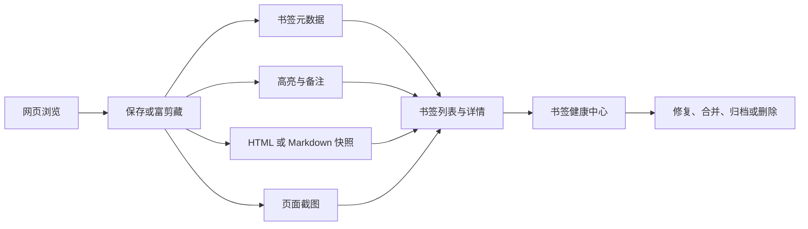

# HamHome 富剪藏、网页截图与书签健康中心 PRD

## 0. 文档信息

| 字段 | 内容 |
| --- | --- |
| 文档状态 | Draft / 待评审 |
| 版本 | v0.1 |
| 日期 | 2026-08-12 |
| 产品范围 | HamHome 浏览器扩展 |
| 目标版本 | 待排期 |
| 涉及能力 | 富剪藏与高亮、网页截图、书签健康中心 |
| 主要平台 | Chrome / Edge / Firefox |

## 1. 执行摘要

HamHome 当前已经完成从“保存链接”到“AI 整理、全文/语义检索、网页快照、工作空间与 WebDAV 同步”的基础建设。本需求进一步补齐三个连续环节：

1. **富剪藏与高亮**：保存用户在页面中真正关注的文字、链接、图片和备注，而不只保存整页链接。
2. **网页截图**：在保存书签时可选地保留用户当时看到的视觉现场，重点服务产品界面、视觉设计和灵感参考场景。
3. **书签健康中心**：持续发现普通书签收藏中的失效、重复与待整理问题，并提供安全、可批量执行的修复动作；图片和文字内容收藏不进入检查范围。

三项能力共同将 HamHome 的使用闭环扩展为：



### 1.1 核心产品决策

- 网页截图与现有 HTML/Markdown 快照是两种独立资产，可分别配置和保存。
- 截图、快照、AI 分析或健康检查失败时，不得回滚已经成功保存的书签。
- 截图默认关闭自动保存，用户可在全局设置中开启，也可在每次保存时单独覆盖。
- 第一阶段截图范围为**当前网页可见区域**，不包含浏览器工具栏和 HamHome 页内浮层。
- 第一阶段保留当前“网格 / 列表”默认视图，只增加截图预览入口；“视觉画廊”作为第三种可选视图分期交付。
- 截图二进制第一阶段仅保存在当前设备，不进入现有 JSON、HTML 或 WebDAV 同步数据。
- 书签健康检查默认由用户手动触发；定期自动检查必须由用户明确开启。
- 健康中心只检查普通书签收藏，不统计、请求或分析图片剪藏和文字剪藏。
- 健康中心只将 `404`、`410` 等明确结果认定为失效，登录限制、限流、网络错误和跨域限制不得直接判定为死链。

## 2. 背景与问题

### 2.1 当前能力基础

HamHome 当前已具备以下可复用基础：

- Popup、快捷键、右键菜单和页内浮层保存入口。
- 页面正文、元数据、AI 摘要、分类和标签提取。
- HTML/Markdown 网页快照及独立 IndexedDB 存储。
- 网格、列表、批量操作和虚拟列表。
- 本地优先存储、WebDAV、导入导出和存储统计。
- Background Service、`browser.alarms`、全网页 host permission 和 `activeTab` 权限。

现有右键菜单已经注册 `page`、`selection`、`link`、`image` 场景，但点击后仍统一进入“保存当前页面”流程，尚未使用 `selectionText`、`linkUrl` 或 `srcUrl`。因此富剪藏首先是对既有入口能力的补全。

### 2.2 用户问题

#### 问题 A：保存粒度过粗

用户经常只想保留一段文案、一个交互说明、一张页面图片或某个链接的上下文，但当前只能保存整个页面。几周后重新打开书签时，还要再次寻找当初真正感兴趣的位置。

#### 问题 B：视觉现场丢失

网页界面会改版、内容会变化、链接会失效。HTML 快照适合离线访问和正文留存，但不等同于用户当时看到的视觉画面。产品设计参考尤其需要保留布局、配色、信息层级和组件组合。

#### 问题 C：收藏库持续老化

随着书签增长，用户难以及时发现：

- 已经失效或发生重定向的链接；
- 导入、历史数据或 URL 变体造成的重复项；
- 没有分类、标签、摘要或正文的待整理项；
- 元数据声称存在但本地二进制已经缺失的快照、截图等资产；
- 向量索引缺失或内容状态异常的书签。

## 3. 产品目标与非目标

### 3.1 产品目标

| ID | 目标 |
| --- | --- |
| G-01 | 用户可以从网页中保存文字高亮、备注、链接和图片上下文 |
| G-02 | 用户可以在保存书签时独立选择是否保存网页截图 |
| G-03 | 用户可以在不离开书签列表的情况下快速判断页面视觉内容 |
| G-04 | 设计参考类收藏可以使用图片优先的方式浏览 |
| G-05 | 用户可以扫描并安全处理重复、失效、待整理和资产异常书签 |
| G-06 | 所有新增能力继续遵守本地优先、隐私可控和数据可迁移原则 |
| G-07 | 新增资产不能显著拖慢大规模书签列表的首屏和滚动性能 |

### 3.2 本期非目标

- 不在第一阶段实现整页滚动截图。
- 不对截图执行 OCR、视觉理解、AI 自动评价或相似界面搜索。
- 不把截图或图片剪藏自动发送给 AI Provider。
- 不在第一阶段通过 WebDAV 同步截图和图片二进制。
- 不在第一阶段提供公开图库、团队协作或图片分享链接。
- 不把“暂时无法验证”“需要登录”“被限流”自动当作失效链接删除。
- 不自动合并任何疑似重复书签。
- 不改变现有网格/列表的默认选择。

## 4. 目标用户与核心场景

### 4.1 产品与视觉设计人员

浏览优秀网站、设计系统、落地页和产品界面时，保存当前页面截图及关键文案，后续在视觉画廊中按分类和标签回顾。

### 4.2 研究与学习用户

阅读文章、文档或教程时，保存关键段落并补充自己的理解；重新打开原网页时可以定位到曾经高亮的位置。

### 4.3 大规模收藏用户

定期扫描收藏库，处理失效链接、历史重复项和未整理书签，同时保留有价值的本地快照、截图与高亮。

## 5. 总体信息架构

### 5.1 保存入口

- 扩展 Popup 保存面板；
- 页内保存浮层；
- 网页右键菜单；
- 书签列表中的“更新截图 / 更新快照”；
- 后续可扩展快捷键，但不属于第一阶段必需项。

### 5.2 消费与管理入口

- 书签列表：截图状态、快速预览、视图切换；
- 书签详情抽屉：摘要、高亮、备注、截图、快照和健康状态；
- 书签健康中心：仅面向普通书签收藏提供扫描概览、问题分组和批量处理；
- 设置页：自动截图、定期健康检查和存储管理；
- 导入/导出页：明确说明图片资产是否包含在备份中。

### 5.3 新增统一详情容器

建议新增 `BookmarkDetailDrawer`，作为三项功能的共同管理入口，避免继续向卡片和编辑弹窗堆叠操作。

详情抽屉包含：

1. **概览**：标题、URL、摘要、分类、标签、保存时间；
2. **剪藏**：高亮、备注、链接和图片剪藏；
3. **视觉资产**：网页截图和 HTML/Markdown 快照；
4. **健康状态**：最近检查结果、重定向、异常原因和修复动作。

现有点击标题或主体区域仍打开原网页；详情抽屉通过卡片菜单中的“查看详情”和截图/高亮状态入口打开，不改变当前主要点击行为。

## 6. 功能一：富剪藏与高亮

### 6.1 用户故事

- 作为阅读用户，我希望右键保存选中的一段文字，以便以后直接看到当初关注的内容。
- 作为研究用户，我希望为高亮补充自己的备注，以便记录这段内容为何重要。
- 作为资料收集用户，我希望保存页面中的目标链接，同时保留它来自哪个页面。
- 作为设计用户，我希望剪藏页面中的图片，并保留来源页面及原图地址。
- 作为回顾用户，我希望重新访问网页时看到仍可定位的历史高亮。

### 6.2 功能范围

| ID | 需求 | 优先级 |
| --- | --- | --- |
| CLIP-001 | 右键选中文字时显示“保存高亮到 HamHome” | P0 |
| CLIP-002 | 高亮可附加一条纯文本备注 | P0 |
| CLIP-003 | 同一书签支持保存多条高亮和备注 | P0 |
| CLIP-004 | 如果当前页面尚未收藏，保存高亮时同时进入书签保存流程 | P0 |
| CLIP-005 | 如果当前页面已经收藏，允许快速追加高亮，并提供撤销入口 | P0 |
| CLIP-006 | 详情抽屉按页面顺序或创建时间展示高亮 | P0 |
| CLIP-007 | 重新打开原页面时尝试恢复高亮位置 | P1 |
| CLIP-008 | 高亮无法重新定位时仍保留原文、备注和来源信息 | P0 |
| CLIP-009 | 右键链接时支持保存目标链接，并记录来源页面 | P1 |
| CLIP-010 | 右键图片时支持保存图片剪藏，并记录来源页面和原图 URL | P1 |
| CLIP-011 | 支持编辑备注、删除单条剪藏和复制高亮文本 | P0 |
| CLIP-012 | 删除书签时剪藏随软删除保留，永久删除时级联清理 | P0 |

### 6.3 右键菜单设计

根据用户点击上下文显示精确动作，不展示无关选项：

| 上下文 | 菜单项 |
| --- | --- |
| 普通页面 | 保存当前页面到 HamHome |
| 选中文字 | 保存高亮到 HamHome |
| 链接 | 保存此链接到 HamHome |
| 图片 | 保存图片剪藏到 HamHome |

当用户同时选中文字并右键链接时，优先显示高亮动作，并可在 HamHome 子菜单中提供链接动作。

### 6.4 高亮保存流程

#### 页面尚未收藏

1. 用户选中文字并点击“保存高亮到 HamHome”；
2. 打开现有保存面板；
3. 面板顶部显示只读的高亮预览，并提供备注输入；
4. 用户编辑书签标题、摘要、分类、标签及资产选项；
5. 先保存书签，再保存高亮；
6. 书签成功、高亮失败时保留书签并显示“重试保存高亮”。

#### 页面已经收藏

1. 默认快速追加高亮；
2. 页面右下角显示非阻塞成功提示；
3. 提示提供“添加备注”“查看详情”“撤销”三个动作；
4. 用户选择“添加备注”时打开轻量输入浮层，不重新走完整保存流程。

### 6.5 高亮定位策略

每条文字高亮至少保存：

- 选中文本原文；
- 前后文片段；
- 来源 URL；
- 创建时间；
- 可选备注；
- Text Quote Selector；
- 可选 DOM 路径作为辅助定位信息。

重新打开页面时：

1. 优先通过精确文本和前后文定位；
2. DOM 路径只作为辅助，不作为唯一依据；
3. 匹配多处时不自动选择，标记为“需要确认”；
4. 页面内容变化导致无法定位时，详情中继续保留剪藏，不丢失数据。

### 6.6 图片和链接剪藏规则

- 链接剪藏创建或更新目标 URL 对应的书签，并额外记录来源页面。
- 第一阶段链接剪藏不为尚未打开的目标页面生成截图或快照。
- 图片剪藏归属于当前页面书签，不创建仅含图片 URL 的独立书签。
- 图片剪藏优先保存本地 Blob；若下载失败，至少保留原图 URL、alt、来源页面和失败状态。
- 图片剪藏与网页截图共享资产存储能力，但数据类型和删除动作独立。

### 6.7 富剪藏验收标准

- 选中文字后可从右键菜单完成保存，且高亮文本与原文一致。
- 新页面和已收藏页面分别走正确流程，不产生重复书签。
- 同一书签至少可稳定保存、编辑和删除 100 条高亮。
- 页面内容变化导致锚点失效时，剪藏内容仍可在详情中阅读和复制。
- 任何单条剪藏失败都不会撤销已经成功保存的书签。
- 快速追加操作提供可用的撤销入口。
- 高亮恢复不会修改原网页 DOM 之外的业务状态，不影响网页表单提交与快捷键。

## 7. 功能二：网页截图保存与视觉浏览

### 7.1 截图与快照的产品定义

| 能力 | 网页截图 | HTML/Markdown 快照 |
| --- | --- | --- |
| 主要目的 | 保存视觉现场、界面与设计参考 | 离线阅读、正文留存和原页面恢复 |
| 内容形态 | 图片 | HTML 或 Markdown |
| 是否可搜索正文 | 否 | 是 |
| 是否保留交互 | 否 | HTML 快照可有限保留 |
| 第一阶段范围 | 当前可见网页区域 | 延续现有逻辑 |
| 第一阶段同步 | 当前设备本地 | 延续现有逻辑 |

两者在保存面板、书签详情、操作菜单和存储统计中必须使用不同图标与文案，避免用户误以为截图就是快照。

### 7.2 用户故事

- 作为产品设计人员，我希望保存当前页面截图，以便未来回顾界面布局和视觉风格。
- 作为普通用户，我希望自行决定哪些书签需要截图，避免所有书签都增加存储占用。
- 作为浏览用户，我希望在列表中快速预览截图，不必打开原网页。
- 作为灵感库用户，我希望切换到图片优先的画廊浏览方式。
- 作为数据管理用户，我希望查看截图占用、下载原图、更新截图或删除截图。

### 7.3 功能范围

| ID | 需求 | 优先级 |
| --- | --- | --- |
| SHOT-001 | 设置页增加“保存书签时默认保存网页截图”开关，默认关闭 | P0 |
| SHOT-002 | 保存面板增加独立“保存页面截图”开关 | P0 |
| SHOT-003 | 截图选项与“保存网页快照”互不依赖 | P0 |
| SHOT-004 | 截图仅包含目标网页可见区域，不包含 HamHome 页内浮层 | P0 |
| SHOT-005 | 截图保存失败不影响书签保存结果 | P0 |
| SHOT-006 | 已有截图的书签支持查看、下载、更新和删除 | P0 |
| SHOT-007 | 书签网格和列表显示轻量截图状态入口 | P0 |
| SHOT-008 | 鼠标悬停截图入口时展示延迟预览 | P0 |
| SHOT-009 | 无 Hover 能力时可点击截图入口打开预览 | P0 |
| SHOT-010 | 新增“视觉画廊”可选视图 | P1 |
| SHOT-011 | 视觉画廊只加载当前视口附近的缩略图 | P0 |
| SHOT-012 | 设置页显示截图数量、总占用并支持单独清理 | P0 |
| SHOT-013 | 书签永久删除时级联删除截图，软删除时保留 | P0 |
| SHOT-014 | 隐私页面默认跳过自动截图，并允许用户单次明确覆盖 | P0 |
| SHOT-015 | 支持整页滚动截图 | P2 |
| SHOT-016 | 支持包含截图资产的 ZIP 备份与恢复 | P2 |

### 7.4 保存面板交互

现有“网页快照”区域调整为“页面资产”，包含两个并列且相互独立的选项：

- 保存网页快照；
- 保存页面截图。

交互要求：

- 每项显示独立说明、开关、保存状态和错误信息；
- 全局设置只决定开关初始值，用户可按当前书签覆盖；
- 更新已有书签时，已有截图默认保留；
- 用户开启截图时，按钮文案根据状态显示“保存截图”或“更新截图”；
- 保存按钮完成后，如果截图仍在处理，面板可进入“书签已保存，截图处理中”；
- 截图失败时提供“重试”，关闭面板后也可从书签菜单重试。

### 7.5 截图触发与内容边界

第一阶段采用当前活动标签页可见区域截图，需满足：

- 使用触发保存时对应的 `tabId`、`windowId` 和 URL，不能误截用户后来切换到的标签页；
- 截图前临时隐藏 HamHome Content UI，截图完成或失败后必须恢复；
- 不包含浏览器标签栏、地址栏、扩展 Popup 和系统界面；
- 不支持 `chrome://`、`edge://`、`about:`、扩展页等浏览器限制页面时，明确显示“当前页面不支持截图”；
- 通过右键保存未打开的目标链接时，不尝试截图目标页面；
- 页面在保存期间发生导航时，取消截图并提示重试，不能把其他页面图片关联到原书签；
- 自动隐私检测命中登录、邮箱、支付、账户等页面时，自动截图默认关闭；手动开启需展示一次性风险提示。

### 7.6 图片格式与派生资源

产品要求保存两份本地资源：

1. **原始预览图**：保留可用于设计参考的清晰度和原始宽高比；
2. **列表缩略图**：用于 Hover 和视觉画廊，最大宽度建议为 640px。

推荐处理策略：

- 优先保存高质量 WebP；浏览器转换失败时回退 PNG；
- 不裁剪原始截图；
- 缩略图保持宽高比，不生成拉伸图；
- 单张图片处理后超过安全大小上限时逐级降低质量，仍超限则非阻塞失败；
- 保存原始宽高、MIME、字节数、捕获时间和来源 URL。

### 7.7 Hover 预览

第一阶段不让整张书签卡片触发预览，而是在卡片或列表项增加明确的截图缩略入口，避免用户移动鼠标时频繁弹出大图。

预览规则：

- Hover 延迟 350ms 左右，移出后短暂延迟关闭，允许鼠标进入预览层；
- 预览宽度根据窗口限制在约 480–640px；
- 预览展示完整缩略图、截图时间和“查看原图”；
- Checkbox、菜单、标签等操作区域不会触发截图预览；
- 使用键盘聚焦截图入口时同样可以打开预览；
- 小窗口或不支持 Hover 的环境改为点击打开。

### 7.8 视觉画廊视图

视觉画廊是现有“网格 / 列表”之外的第三种可选视图，面向设计参考、灵感采集和图片资料场景。

产品规则：

- 不改变现有用户默认视图；
- 沿用现有搜索、分类、标签、时间和自定义筛选条件；
- 优先展示有截图或图片剪藏的书签；
- 无截图书签默认隐藏，可通过“包含无图片书签”开关显示；
- 使用瀑布流保持截图原始宽高比，不强制统一裁剪；
- 每张视觉卡片展示截图、标题、域名、分类、标签和保存时间；
- Hover 显示打开网页、查看详情、更新截图、下载和删除等快捷动作；
- 点击图片打开原图预览，点击标题打开原网页；
- 视图选择持久化，但不强制所有分类使用同一视图。

### 7.9 截图验收标准

- 自动截图默认关闭，设置与单次保存开关均能正确生效。
- 同一次保存可以只存快照、只存截图、两者都存或两者都不存。
- 截图中不得出现 HamHome 页内浮层或其他扩展 UI。
- 截图失败时书签仍显示保存成功，并提供可操作的失败状态与重试入口。
- 更新截图不会生成重复资产，旧截图在新截图完整写入后再删除。
- 网格和列表首屏不会一次性加载全部原图。
- 视觉画廊在 1,000 条书签、300 张截图的测试数据下仍可连续滚动，不因 Blob URL 泄漏持续增长内存。
- 清理截图数据后，书签、快照、高亮和备注不受影响。
- Firefox、Chrome 和 Edge 均能完成支持页面的可见区域截图；不支持场景有明确降级文案。

## 8. 功能三：书签健康中心

### 8.1 用户故事

- 作为收藏库维护者，我希望一次扫描发现明确失效的链接。
- 作为导入大量历史书签的用户，我希望发现规范化 URL 或 canonical URL 相同的重复项。
- 作为谨慎用户，我希望系统只给出建议，由我决定是否合并、更新或删除。
- 作为离线资料用户，我希望链接失效后仍能快速打开已有快照或截图。
- 作为同时保存书签、图片和文字的用户，我希望健康中心只统计书签收藏，不把内容收藏混入结果。

### 8.2 健康中心入口

第一阶段在书签列表顶部工具栏提供“书签体检”入口，不立即增加主侧栏一级导航。

入口展示：

- 最近一次扫描时间；
- 待处理问题数量；
- 扫描进行状态；
- 严重问题存在时显示低干扰提示，不使用持续红色告警。

点击后进入独立健康中心页面或全宽面板。

检查范围以普通书签收藏为准。图片剪藏和选中文字剪藏虽然共用 `LocalBookmark` 承载索引，但属于内容收藏，不出现在健康中心列表、统计、重复项判断和定期扫描中。

### 8.3 健康问题分类

| 分类 | 判定 | 级别 | 默认动作 |
| --- | --- | --- | --- |
| 明确失效 | HTTP `404`、`410` 或明确无效协议 | 错误 | 打开快照、编辑 URL、归档或删除 |
| 重定向 | 最终 URL 与保存 URL 不同 | 提醒 | 查看并确认更新 URL |
| 无法验证 | 离线、超时、DNS、CORS、`401`、`403`、`429`、`5xx` | 待确认 | 重试、忽略、手动打开 |
| 高置信重复 | 规范化 URL 完全相同 | 警告 | 比较并合并 |
| 疑似重复 | canonical URL 相同，或标题/域名高度相似 | 建议 | 人工确认 |
| 待整理 | 无分类、无标签、无摘要 | 建议 | 批量分类、标签或 AI 整理 |

图片剪藏、文字剪藏、截图与快照不属于健康中心扫描对象；健康中心不会读取或分析这些内容。

### 8.4 扫描规则

#### 链接检查

- 默认由用户手动开始；
- 支持仅扫描选中书签、当前筛选结果或全部书签；
- 使用有限并发和域名级节流，避免对同一站点高频请求；
- 优先尝试轻量请求，站点不支持时使用安全 GET 降级；
- 健康检查不携带登录 Cookie 或用户凭据；
- 用户离线时暂停任务，不写入“失效”结果；
- 结果包含检查时间、HTTP 状态、最终 URL 和分类原因；
- 结果超过设定有效期后标记为“需复查”，不永久代表当前状态。

#### 重复检查

分成两种置信度：

1. **高置信重复**：使用保守 URL 规范化规则后完全相同；
2. **疑似重复**：canonical URL 相同、重定向到同一最终地址，或标题与域名高度接近。

URL 规范化不得默认移除所有查询参数。只可安全处理协议/主机大小写、默认端口、末尾斜杠、URL fragment 和明确的追踪参数。业务参数差异必须保留。

#### 范围过滤

- 扫描开始前根据剪藏主体索引排除图片和选中文字内容；
- 全量扫描、单条扫描、定期扫描、统计和重复检测使用同一份普通书签集合；
- 历史版本为内容收藏留下的健康记录应在后续扫描时清理；
- 不下载、解析或分析图片和选中文字正文。

### 8.5 健康中心页面

页面包含四个区域：

1. **概览**：健康、错误、待确认和建议数量；
2. **扫描控制**：扫描范围、进度、暂停、继续和取消；
3. **问题分组**：失效与重定向、重复项和待整理；
4. **处理记录**：最近处理、忽略和失败操作。

每个问题列表支持：

- 单条或批量选择；
- 查看原书签与详情；
- 查看检测依据；
- 修复、忽略、稍后处理；
- 操作前预览影响范围；
- 操作完成后撤销可恢复的更改。

### 8.6 修复动作

#### 失效链接

- 打开本地快照；
- 查看保存截图；
- 编辑 URL；
- 接受重定向后的 URL；
- 重新检查；
- 归档或软删除。

#### 重复书签

合并前展示左右对比，用户选择保留项。合并规则：

- 标题和摘要默认保留用户选择的主项；
- 分类由用户确认；
- 标签取并集；
- 高亮和备注全部保留并去除完全相同记录；
- 截图和快照不能静默覆盖；若两项都有资产，允许选择主资产或保留历史版本；
- 创建时间默认取最早值，更新时间取最新值；
- 被合并项先软删除，提供撤销，不直接永久删除。

#### 待整理书签

- 批量分配分类；
- 批量添加/移除标签；
- 触发现有 AI 整理；
- 补建 Embedding；
- 打开页面后手动补截图或快照。

### 8.7 定期检查

第一阶段只做手动扫描。后续可增加：

- 关闭 / 每周 / 每月；
- 仅在浏览器空闲且在线时执行；
- 默认不弹系统通知，只在书签列表入口显示结果；
- 用户可选择仅检查新书签或上次超过有效期的书签；
- 自动任务只扫描，不自动合并、更新或删除。

### 8.8 健康中心验收标准

- `404`、`410` 能稳定归类为明确失效。
- `401`、`403`、`429`、`5xx`、网络断开和超时不会归类为明确失效。
- 扫描支持暂停、取消和恢复，不因关闭页面留下不可恢复的锁。
- 批量扫描具备并发和域名节流，取消后不继续产生新请求。
- 重复合并前必须展示差异，且默认执行软删除。
- 合并后标签、高亮、备注和用户选定资产不会丢失。
- 健康检查结果不会通过 HamHome 自有服务器上传。
- 图片剪藏和文字剪藏不会出现在列表、统计、重复项或网络请求中。
- 忽略某条问题后，不在同一问题指纹下重复提示；检测依据发生变化时可重新出现。

## 9. 跨功能体验要求

### 9.1 页面资产必须独立

同一书签可能具有以下任意组合：

- 0–N 条文字高亮；
- 0–N 条备注；
- 0–N 条链接或图片剪藏；
- 0–1 个当前网页截图；
- 0–1 个当前网页快照；
- 0–1 条当前健康记录。

任何一种资产删除或失败都不能隐式删除其他资产。

### 9.2 状态反馈

所有异步资产任务统一使用以下状态：

- `idle`；
- `queued`；
- `processing`；
- `ready`；
- `skipped`；
- `failed`。

保存面板需要分别展示书签、高亮、截图和快照的状态，不使用一个笼统的 Loading 覆盖所有任务。

### 9.3 可访问性

- Hover 预览必须有键盘和点击等价操作；
- 截图按钮提供可读名称，不只使用图标或颜色；
- 高亮颜色满足浅色/深色主题对比度要求；
- 健康状态同时使用文字、图标和颜色；
- 弹窗、抽屉和预览支持 `Esc` 关闭并正确恢复焦点；
- 视觉画廊中的图片使用书签标题作为替代文本。

### 9.4 国际化

所有新增界面、状态、错误和菜单项同时提供中文与英文文案。HTTP 状态和技术错误需转换为用户可理解的描述，原始错误仅放入可展开详情。

## 10. 数据模型建议

以下为产品层建议，最终字段命名可在技术设计阶段调整。

### 10.1 富剪藏

```ts
type BookmarkClipType = "highlight" | "note" | "link" | "image";

interface BookmarkClip {
  id: string;
  bookmarkId: string;
  type: BookmarkClipType;
  text?: string;
  note?: string;
  targetUrl?: string;
  sourceUrl: string;
  sourceTitle?: string;
  imageAssetId?: string;
  imageSourceUrl?: string;
  selector?: {
    exact: string;
    prefix?: string;
    suffix?: string;
    domPath?: string;
  };
  createdAt: number;
  updatedAt: number;
}
```

文字型剪藏属于结构化数据，应纳入 JSON 导出和 WebDAV 同步；图片 Blob 第一阶段仅保存在本地。

### 10.2 截图资产

```ts
interface BookmarkScreenshotAsset {
  id: string;
  bookmarkId: string;
  sourceUrl: string;
  image: Blob;
  thumbnail: Blob;
  mimeType: string;
  width: number;
  height: number;
  size: number;
  capturedAt: number;
  updatedAt: number;
}
```

截图存在性应通过**本地资产索引**批量读取，不建议直接复用会同步到其他设备的 `hasScreenshot` 布尔字段。否则远端设备可能得到“有截图”状态，却没有对应 Blob。

### 10.3 健康记录

```ts
type BookmarkLinkHealthStatus =
  | "unchecked"
  | "healthy"
  | "redirected"
  | "broken"
  | "auth_required"
  | "rate_limited"
  | "server_error"
  | "network_error"
  | "unsupported";

interface BookmarkHealthRecord {
  bookmarkId: string;
  checkedAt: number;
  status: BookmarkLinkHealthStatus;
  httpStatus?: number;
  finalUrl?: string;
  issueCodes: string[];
  ignoredIssueFingerprints?: string[];
}
```

健康结果具有设备和网络环境属性，第一阶段仅本地保存，不进入 WebDAV。

### 10.4 设置项

```ts
interface LocalSettings {
  autoSaveScreenshot: boolean;
  screenshotPrivatePagePolicy: "skip" | "ask";
  bookmarkHealthSchedule: "off" | "weekly" | "monthly";
}
```

建议默认值：

- `autoSaveScreenshot: false`；
- `screenshotPrivatePagePolicy: "ask"`，但自动流程仍先跳过；
- `bookmarkHealthSchedule: "off"`。

## 11. 存储、同步与数据生命周期

### 11.1 存储建议

- 截图、截图缩略图和图片剪藏 Blob 使用独立 IndexedDB Store；
- 富剪藏文本与书签元数据分离，避免书签列表加载全部剪藏正文；
- 健康记录独立存储，避免每次状态更新触发整份书签元数据同步；
- 列表一次性批量获取“哪些书签有截图/高亮”的轻量索引；
- Blob URL 必须在组件卸载或资源切换时及时回收。

### 11.2 删除规则

| 操作 | 书签 | 高亮/备注 | 截图 | 快照 | 健康记录 |
| --- | --- | --- | --- | --- | --- |
| 软删除 | 保留 | 保留 | 保留 | 保留 | 保留 |
| 恢复 | 恢复 | 恢复 | 恢复 | 恢复 | 恢复 |
| 永久删除 | 删除 | 删除 | 删除 | 删除 | 删除 |
| 清理截图 | 保留 | 保留 | 删除 | 保留 | 更新资产状态 |
| 清理健康记录 | 保留 | 保留 | 保留 | 保留 | 删除 |

### 11.3 同步与导出边界

第一阶段：

- 高亮、备注和链接剪藏进入 HamHome JSON 与 WebDAV 结构化数据；
- 截图、缩略图和图片剪藏 Blob 仅保存在本地；
- 健康记录仅保存在本地；
- JSON 导出必须明确显示“不包含截图、快照和图片文件”；
- 截图支持单张下载。

后续阶段增加统一 HamHome Archive ZIP，包含结构化数据、截图、快照和图片剪藏，并支持恢复前校验。

## 12. 隐私与安全要求

- 所有截图和图片默认保存在本地 IndexedDB。
- 不把截图、剪藏图片或健康扫描结果发送到 HamHome 自有服务器。
- AI 分析默认只延续现有文本流程，不读取新增图片资产。
- 自动隐私检测命中时不自动截图；用户单次覆盖前提示可能包含账户、聊天、邮件、支付或个人数据。
- 健康检查使用无凭据请求，不携带 Cookie、Authorization 或页面会话信息。
- 书签合并、URL 更新和批量删除均需预览影响范围。
- 永久删除资产前需要确认；可恢复操作优先软删除。
- 截图内容中不得包含 HamHome 自身浮层，以免把用户输入的分类、标签或备注一并记录。

## 13. 性能要求

| 场景 | 要求 |
| --- | --- |
| 普通网格/列表 | 不加载截图原图，只加载可见范围内的缩略图 |
| Hover 预览 | 延迟加载，关闭后释放不再使用的 Blob URL |
| 视觉画廊 | 使用虚拟化或可见区域加载，支持取消过期请求 |
| 截图保存 | 图片压缩与缩略图生成不得阻塞书签元数据写入 |
| 健康扫描 | 有限并发、域名节流、可暂停和取消 |
| 剪藏列表 | 默认只加载数量与摘要，展开详情时加载完整内容 |

建议测试基线：1,000 条书签、300 张截图、2,000 条高亮、100 个失效或重复问题。

## 14. 成功指标

HamHome 当前坚持本地优先且不依赖开发者侧分析服务，因此第一阶段指标以本地可选统计、E2E 数据和用户访谈为主。

### 14.1 产品指标

- 保存书签时主动开启截图的比例；
- 有截图书签的预览打开率；
- 视觉画廊的重复使用率；
- 高亮保存后再次查看或打开来源页的比例；
- 健康扫描启动率、问题处理率和忽略率；
- 失效书签通过快照或截图继续访问的比例。

### 14.2 质量指标

- 支持页面截图成功率；
- 截错标签页、包含 HamHome 浮层等严重错误必须为零；
- 明确失效链接分类准确率；
- 健康扫描误删必须为零；
- 截图失败导致书签保存失败必须为零；
- 资产索引与 Blob 不一致可被完整性扫描发现。

## 15. 分期建议

### Phase 0：资产与任务基础

- 统一本地 Asset Storage；
- Screenshot / Clip / Health 数据模型和迁移；
- Background Service 合同；
- 独立任务状态与失败重试；
- 存储统计和清理能力。

### Phase 1：核心闭环

- 文字高亮与备注；
- 当前可见区域截图；
- 保存面板独立截图开关；
- 书签详情抽屉；
- 网格/列表截图入口与 Hover/点击预览；
- 手动健康扫描；
- 明确失效、重定向、高置信重复、待整理和资产异常处理。

### Phase 2：视觉参考库强化

- 视觉画廊；
- 图片和链接富剪藏；
- 整页滚动截图实验；
- Screenshot/Clip 组合筛选；
- HamHome Archive ZIP 备份与恢复。

### Phase 3：自动维护

- 每周或每月健康扫描；
- 高亮回到原网页的自动定位；
- 历史截图版本；
- 可选 WebDAV 二进制资产同步；
- 相似视觉参考和 OCR/AI 图片理解，需单独隐私评审。

## 16. 依赖与影响范围

### 16.1 预计涉及模块

- `entrypoints/background.ts`：上下文菜单、截图、健康检查任务；
- `components/SavePanel/*`：截图与富剪藏保存状态；
- `components/BookmarksPage.tsx`：入口、第三种视图和问题状态；
- `packages/ui-business/src/bookmark/*`：共享卡片、列表和操作合同；
- `lib/storage/*`：剪藏、截图、健康记录和资产索引；
- `lib/services/background-service-*`：跨上下文服务合同；
- `lib/sync/*`：富剪藏结构化同步；
- `components/options/*`：默认开关、存储统计和定期检查；
- `locales/*` 与 package scoped `docs/components.md`。

### 16.2 浏览器能力

- 复用现有 `activeTab`、`tabs`、`scripting`、`alarms` 和 `<all_urls>`；
- 第一阶段不应引入 `debugger` 等高风险权限；
- 若未来增加系统通知，需要单独说明并申请 `notifications` 权限；
- Firefox 与 Chromium 的截图、Context Menu 和 Background 生命周期需要分别验证。

## 17. 风险与缓解

| 风险 | 影响 | 缓解 |
| --- | --- | --- |
| 页内保存浮层被截入图片 | 泄露用户输入且截图不可用 | 截图前隐藏 Content UI，完成后在 `finally` 中恢复 |
| 截到错误标签页 | 图片与书签错配 | 固定并校验 `tabId`、`windowId`、URL，导航后取消 |
| 自动截图隐私页面 | 保存敏感信息 | 默认关闭，隐私页自动跳过，手动覆盖需确认 |
| 截图导致存储快速增长 | 性能和配额风险 | 默认关闭、WebP、缩略图、统计和独立清理 |
| Hover 大量解码图片 | 列表卡顿 | 明确入口、延迟加载、缩略图和 Blob URL 回收 |
| 高亮锚点因页面变化失效 | 无法恢复原位置 | Text Quote + 前后文；失败仍保留内容 |
| 健康检查误判 | 用户错误删除有效资料 | 严格状态分类、人工确认、默认软删除 |
| HEAD 被站点拒绝 | 大量误报 | 安全 GET 降级；`401/403/429/5xx` 不判死链 |
| 跨设备显示“有截图但打不开” | 数据语义不一致 | 截图存在性使用本地资产索引，不同步假状态 |
| 重复合并覆盖资产 | 数据丢失 | 对比预览、资产冲突选择、软删除和撤销 |

## 18. 测试与验收计划

### 18.1 单元测试

- Text Quote Selector 创建与恢复；
- URL 规范化和追踪参数处理；
- HTTP 状态分类；
- 重复合并规则；
- Screenshot Asset Storage CRUD；
- 缩略图生成与失败回退；
- 永久删除级联与孤立资产检测；
- 数据迁移与旧数据兼容。

### 18.2 集成测试

- 新书签 + 高亮 + 截图 + 快照组合保存；
- 已有书签追加高亮与更新截图；
- 截图/快照失败不影响书签；
- 页内浮层隐藏、恢复和异常分支；
- 健康扫描暂停、恢复、取消和浏览器重启恢复；
- 重复合并后标签、高亮、备注和资产正确保留；
- 清理截图后其他数据不变。

### 18.3 E2E 与视觉验证

- Chrome 中文/英文、浅色/深色保存流程；
- Popup 与页内浮层的截图开关和状态；
- 截图结果不包含 HamHome 浮层；
- 网格、列表、视觉画廊和 Hover 预览；
- 健康中心概览、分组、批量处理和撤销；
- Firefox 与 Edge 手工验证截图、右键菜单和不支持页面降级；
- 1,000 条书签数据下的滚动、内存与任务取消行为。

## 19. 待评审决策

| 决策 | 当前建议 |
| --- | --- |
| 自动截图默认值 | 关闭 |
| 第一阶段截图范围 | 当前可见网页区域 |
| 是否直接改变现有卡片为图片卡片 | 否，新增可选视觉画廊 |
| Hover 触发范围 | 只在明确截图入口触发，不覆盖整卡 |
| 截图同步 | 第一阶段本地设备专属 |
| 图片剪藏交付时机 | Phase 2，Phase 1 先完成文字高亮与备注 |
| 自动健康扫描 | 第一阶段关闭，仅手动触发 |
| 健康中心导航位置 | 第一阶段放在书签工具栏，验证使用率后再决定是否升为侧栏一级入口 |
| 整页滚动截图 | Phase 2 单独实验，不阻塞可见区域截图上线 |

## 20. Definition of Done

本需求只有在以下条件全部满足时才可视为完成：

- 三项能力的范围、默认值、同步边界和隐私策略经过产品评审；
- 新旧数据迁移可逆且不破坏现有书签、快照和 WebDAV；
- 书签保存与新增资产任务实现失败隔离；
- 富剪藏、截图、健康中心均有独立单元和 E2E 覆盖；
- 网格、列表和视觉画廊在浅色/深色、中英文下完成真实扩展 UI 验证；
- Chrome、Edge、Firefox 的支持和降级行为有验证记录；
- `apps/extension/docs/components.md` 随新增组件及 API 同步更新；
- 存储清理、永久删除、导出说明和隐私文案完整；
- 没有把用户截图、图片、高亮或健康结果上传到未声明的服务。
