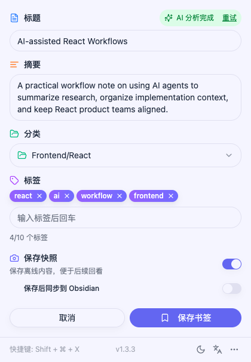
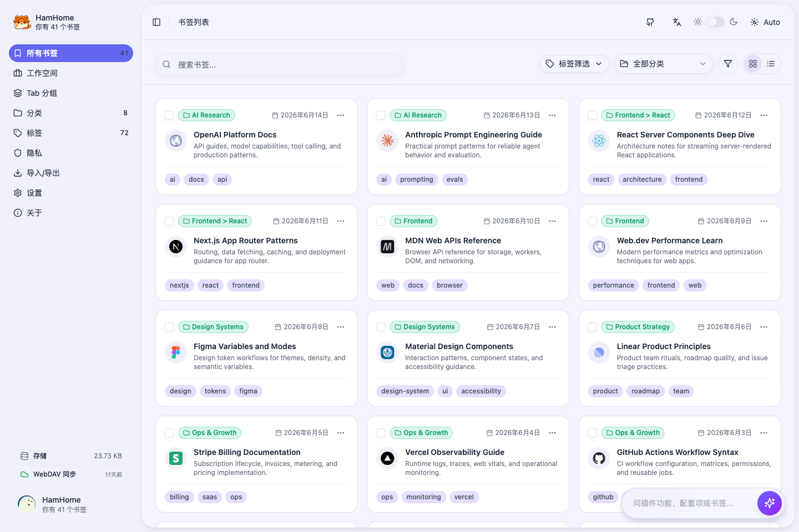
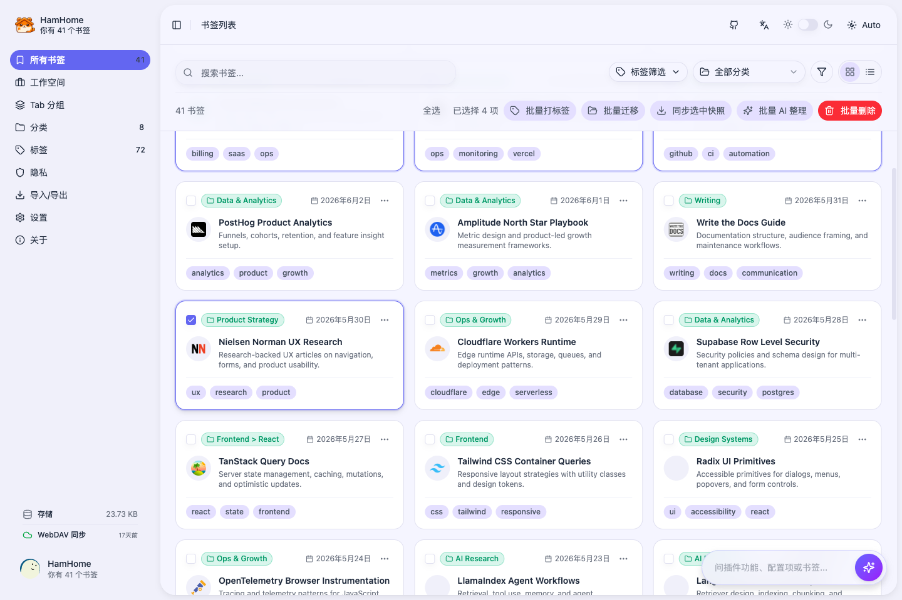
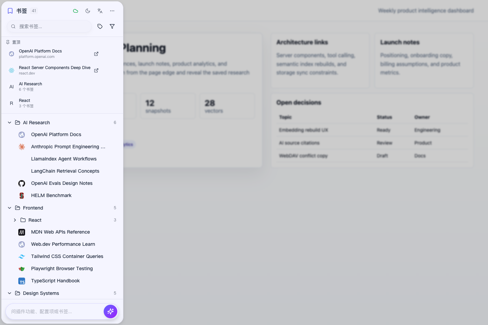
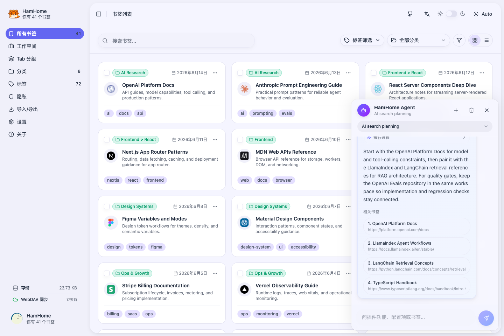
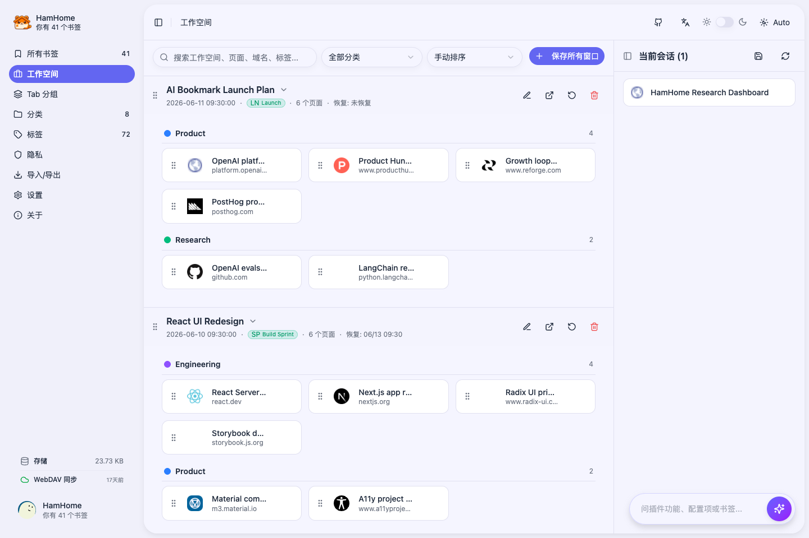
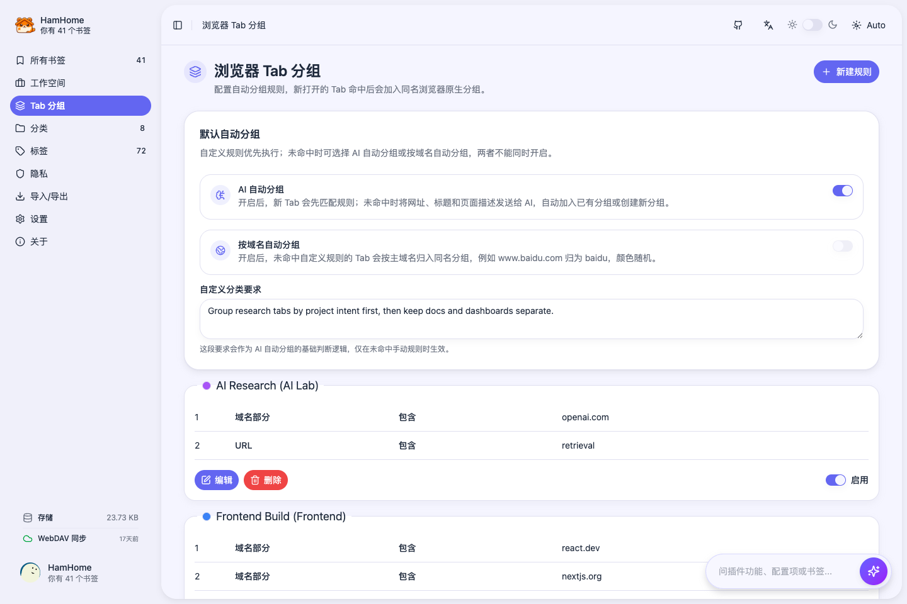

<p>
  
</p>

# HamHome（仓鼠家）

**AI 浏览器工作台：统一管理书签、标签页、工作空间，并内置 Agent 让你更容易的操作插件**

<p>
  
  
  
  
  
</p>

<p>
  <a href="https://bingoyb.github.io/ham_home/">产品介绍</a> •
  <a href="../README.md">English</a> •
  <a href="./USAGE_zh.md">使用文档</a> •
  <a href="./USAGE_en.md">Usage</a> •
  <a href="#功能特性">功能特性</a> •
  <a href="#开发">开发</a>
</p>

## 什么是 HamHome？

HamHome（仓鼠家）是一款浏览器扩展，用来把日常浏览转成可整理、可搜索、可恢复的个人工作台。它把 AI 辅助收藏、书签管理、网页快照、能理解并操作插件的 Agent、可恢复的标签页工作空间，以及浏览器原生 Tab Group 自动分组整合在一起。

默认情况下，书签、分类、设置、快照、向量索引、工作空间和规则保存在浏览器本地。你可以接入自己的 AI Provider 做分析和语义搜索，也可以通过 WebDAV、JSON/HTML 导入导出在设备之间迁移结构化数据。

👉 **[查看产品介绍](https://bingoyb.github.io/ham_home/)** - 了解产品能力与下载方式。

## 产品截图

| **快速保存弹窗** | **书签库** |
| :--: | :--: |
|  |  |
| **批量整理书签** | **网页内侧边面板** |
|  |  |
| **AI Agent** | **工作空间** |
|  |  |
| **Tab 分组规则** | **导入导出与同步** |
|  |  |

## 功能特性

### AI 辅助收藏

- 支持通过插件弹窗、右键菜单、快捷键或网页内面板保存当前页面。
- 使用 Defuddle、Mozilla Readability 与 SingleFile 风格捕获提取页面元信息、正文和快照。
- 配置 AI 后，可生成摘要、分类、标签，并可按需翻译内容。
- 在书签管理页对已有书签进行批量 AI 重新分析。

### AI Agent 与搜索

- 支持按标题、URL、描述、正文、分类、标签、域名和时间范围搜索。
- 可启用 Embedding 语义搜索，并使用关键词 + 向量的混合排序。
- 内置 AI Agent，可理解 HamHome 功能与设置、检查状态、搜索/总结已保存页面、打开插件页面，并在安全范围内处理非敏感配置。
- 可在浏览器地址栏使用 `ham` omnibox 关键词搜索书签和工作空间。

### 工作空间与标签页会话

- 将当前窗口保存为可恢复工作空间，记录页面顺序、favicon、固定状态和原生 Tab Group 信息。
- 可恢复全部或选中页面到当前窗口/新窗口，并跳过重复 URL。
- 工作空间拥有独立分类和标签，不与书签分类混用。
- 可分析工作空间页面，识别重复项、粗略用途/分类，并推荐适合转为长期书签的页面。
- 支持拖拽调整页面、在工作空间之间移动页面、编辑页面信息、复制 URL、转为书签。

### 浏览器原生 Tab Group 自动化

- 可按域名、URL 文本、标题、忽略大小写标题或正则创建自动分组规则。
- 支持配置分组名称、颜色、折叠状态、排序和多条匹配条件。
- 未命中手动规则时，可选择按根域名自动分组，或调用 AI 自动分组；手动规则始终优先。
- AI 自动分组会参考标题、URL、页面元数据、已有分组名称和自定义分组要求，并按域名与要求缓存结果。
- Chromium 浏览器通过 `chrome.tabGroups` 自动执行规则；Firefox 可保存规则，但原生自动分组取决于浏览器 API 支持。

### 网页快照与 Obsidian

- 支持保存本地 HTML 或 Markdown 快照，用于离线查看。
- 可在书签管理页查看、下载、更新或删除快照。
- 支持通过 `obsidian://new` 流程把 Markdown 风格书签笔记同步到 Obsidian，并带剪贴板兜底和内容未变跳过逻辑。
- 可在设置中查看与清理快照占用。

### 导入、导出与同步

- JSON 完整备份包含书签、分类、工作空间、工作空间分类、Tab 分组规则和自动分组设置。
- 可导出可直接浏览的 HTML 书签页。
- 可导入 HamHome JSON 备份，或导入 Chrome、Firefox、Edge 等浏览器的标准书签 HTML 文件。
- 可通过浏览器 bookmarks API 直接导入原生书签，支持保留目录层级或启用 AI 分析。
- 可把 HamHome 中整理好的书签反向写回浏览器书签栏，并配置根文件夹、是否先清空、是否跳过重复项。
- WebDAV 会在 `/HamHomeSync` 下同步结构化数据：设置、书签/分类数据、书签正文、工作空间、工作空间分类和 Tab 分组配置。本地 HTML/Markdown 快照 Blob 不作为 WebDAV 完整快照同步内容，除非通过导出或 Obsidian 工作流另行处理。

### 存储与隐私保护

- 主要数据保存在浏览器存储和 IndexedDB 中，无需 HamHome 托管账号。
- 自带 AI Key 与端点。聊天模型 Provider 支持 OpenAI、Anthropic、Google Gemini、Azure OpenAI、DeepSeek、Groq、Mistral、Moonshot/Kimi、智谱/GLM、腾讯混元、NVIDIA NIM、SiliconFlow、Ollama 和自定义 OpenAI 兼容 API。
- Embedding 可独立配置。语义搜索支持 OpenAI、Google、Azure、Mistral、智谱、混元、NVIDIA、SiliconFlow、Ollama 和自定义 OpenAI 兼容 API。
- 可通过隐私域名和自动隐私检测，跳过敏感站点的 AI 分析。
- API Key、Base URL、隐私域名、WebDAV 凭据和浏览器快捷键必须由用户手动配置；Agent 不会读取或代填这些敏感项。

### 现代扩展界面

- 主应用包含书签、分类、标签、工作空间、Tab 分组、导入导出、隐私、设置和关于页面。
- 弹窗保存面板适合快速收藏当前网页。
- 网页内边缘触发书签面板支持左/右位置。
- 支持浅色、深色、跟随系统主题，以及中英文国际化。
- 提供同步状态、快捷键展示、自定义筛选器、标签云、存储统计和向量索引控制。

## 浏览器支持

| 浏览器 | 支持状态 |
| --- | --- |
| Chrome / Chromium | Manifest V3 |
| Microsoft Edge | Manifest V3 |
| Firefox | Firefox 构建，配置最低版本 109+；原生 Tab Group 自动化取决于浏览器 API 支持 |

## 下载

- [**Chrome Web Store**](https://chromewebstore.google.com/detail/hamhome-%E6%99%BA%E8%83%BD%E4%B9%A6%E7%AD%BE%E5%8A%A9%E6%89%8B/mkdokbchcfegdkgoiikagecikldbkbmg)
- [**Firefox Add-ons**](https://addons.mozilla.org/zh-CN/firefox/addon/hamhome-%E6%99%BA%E8%83%BD%E4%B9%A6%E7%AD%BE%E5%8A%A9%E6%89%8B/)
- [**Microsoft Edge Addons**](https://microsoftedge.microsoft.com/addons/detail/hamhome-smart-bookmark-/nmbdgbicgagmokdmohgngcbhkaicfnpi)
- [**GitHub Releases**](https://github.com/bingoYB/ham_home/releases) 可下载手动安装包。

## 从源码安装

```bash
git clone https://github.com/bingoYB/ham_home.git
cd ham_home
pnpm install
pnpm build:extension
```

加载构建产物：

- **Chrome / Chromium**：打开 `chrome://extensions/`，启用开发者模式，选择“加载已解压的扩展程序”，目录为 `apps/extension/.output/chrome-mv3`。
- **Microsoft Edge**：打开 `edge://extensions/`，启用开发者模式，选择“加载解压缩的扩展”，目录为 `apps/extension/.output/edge-mv3`。
- **Firefox**：打开 `about:debugging`，选择“此 Firefox”，点击“临时载入附加组件”，选择 `apps/extension/.output/firefox-mv2/manifest.json`。

## 开发

```bash
# 安装依赖
pnpm install

# 扩展开发
pnpm dev:extension
pnpm dev:ext-firefox
pnpm dev:ext-edge

# Next.js 产品介绍站
pnpm dev:web

# 构建
pnpm build
pnpm build:extension
pnpm build:web

# 打包与提交
pnpm zip:extension
pnpm submit:init
pnpm submit:extension

# 测试与截图
pnpm --filter hamhome test
pnpm --filter hamhome test:e2e:install
pnpm --filter hamhome test:e2e
pnpm --filter hamhome screenshots
```

## 技术栈

<p>
  
  
  
  
</p>

- **Monorepo**：pnpm workspaces + Turborepo
- **浏览器扩展**：WXT + React 19 + TypeScript + Tailwind CSS 4
- **产品介绍站**：Next.js 16 + React 19
- **UI**：shadcn/ui 风格组件、Radix UI、lucide-react、共享 `@hamhome/ui` 与 `@hamhome/ui-business`
- **AI**：`@browser-agent-sdk/agent`、Provider 适配、Embedding 队列、混合检索
- **内容提取**：Defuddle、Mozilla Readability、SingleFile 风格捕获、Turndown/Markdown 工作流
- **存储**：WXT Storage、浏览器存储 API、IndexedDB 快照/AI 缓存/向量数据
- **同步**：WebDAV、gzip 压缩书签正文分片、同步锁、本地凭据混淆
- **测试**：Vitest + Playwright 扩展 E2E + 自动截图套件

## 项目结构

```text
ham_home/
├── apps/
│   ├── extension/          # WXT 浏览器扩展
│   │   ├── components/     # React 功能组件
│   │   ├── contexts/       # 书签与应用状态 Context
│   │   ├── entrypoints/    # app、popup、content、background 入口
│   │   ├── hooks/          # 扩展 Hooks
│   │   ├── lib/            # AI、Agent、搜索、同步、存储、服务
│   │   ├── locales/        # 中英文 i18n 资源
│   │   └── e2e/            # Playwright 扩展测试与截图生成
│   └── web/                # Next.js 产品介绍站
├── packages/
│   ├── ui/                 # 共享 UI 基础组件
│   ├── ui-business/        # HamHome 业务 UI 组件
│   ├── types/              # 共享 TypeScript 类型
│   ├── utils/              # 通用工具函数
│   ├── parser/             # 内容解析包
│   ├── storage/            # 存储抽象包
│   ├── db/                 # Drizzle Schema 包
│   ├── api/                # Cloudflare Workers / Hono API 包
│   └── i18n/               # 共享国际化包
└── docs/                   # 产品文档、中文 README、截图、设计说明
```

## 贡献

欢迎贡献代码。请保持变更聚焦，遵循现有 TypeScript 与 React 组织方式，并为扩展核心流程补充测试或手动验证说明。

1. Fork 本仓库。
2. 创建特性分支：`git checkout -b feature/your-feature`。
3. 使用有范围的提交信息，推荐 Conventional Commits。
4. 推送分支并发起 Pull Request。

## 许可证

[MIT](../LICENSE)

---

<p align="center">
  如果 HamHome 对你有帮助，欢迎给一个 Star。
</p>
